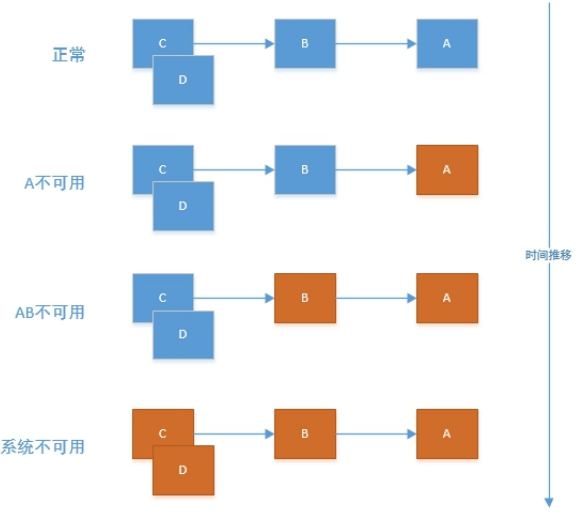

# 工程笔记

说明：本来一开始是用`IDEA2018`加`jdk11`的，后面发现`IDEA2018`有坑，所以还是换到`IDEA2017`，而这个版本不支持`jdk11`，所以下面涉及到的`jdk11`的内容可以忽略。

# 一、创建父工程

创建一个简单的`maven`工程（不要使用模板）即可，创建好之后删除`src`目录，同时将所有笔记存放在`note`目录中，下面给出`pom`文件：

```xml
<?xml version="1.0" encoding="UTF-8"?>
<project xmlns="http://maven.apache.org/POM/4.0.0"
         xmlns:xsi="http://www.w3.org/2001/XMLSchema-instance"
         xsi:schemaLocation="http://maven.apache.org/POM/4.0.0 http://maven.apache.org/xsd/maven-4.0.0.xsd">
	<modelVersion>4.0.0</modelVersion>

	<groupId>win.iot4yj</groupId>
	<artifactId>tensquare</artifactId>
	<version>1.0-SNAPSHOT</version>
</project>
```

后面会在父工程中添加一些依赖，可以直接查看工程中的该文件。


# 二、将该工程交由git管理

## 2.1 创建github仓库

首先在`github`上创建一个仓库`tensquare`：


然后进入到工程目录下打开`git bash`

```shell
#初始化
yj@DESKTOP-9OGTO9E MINGW64 /e/IDEA/workspace/tensquare
$ git init
Initialized empty Git repository in E:/IDEA/workspace/tensquare/.git/

#将所有文件交由git管理
yj@DESKTOP-9OGTO9E MINGW64 /e/IDEA/workspace/tensquare (master)
$ git add .
warning: LF will be replaced by CRLF in .idea/inspectionProfiles/Project_Default.xml.
The file will have its original line endings in your working directory.
warning: LF will be replaced by CRLF in .idea/inspectionProfiles/profiles_settings.xml.
The file will have its original line endings in your working directory.
warning: LF will be replaced by CRLF in .idea/workspace.xml.
The file will have its original line endings in your working directory.
warning: LF will be replaced by CRLF in pom.xml.
The file will have its original line endings in your working directory.

#提交
yj@DESKTOP-9OGTO9E MINGW64 /e/IDEA/workspace/tensquare (master)
$ git commit -m "初始化项目"
[master (root-commit) 575b977] 初始化项目
 20 files changed, 853 insertions(+)
 create mode 100644 .idea/encodings.xml
 create mode 100644 .idea/inspectionProfiles/Project_Default.xml
 create mode 100644 .idea/inspectionProfiles/profiles_settings.xml
 create mode 100644 .idea/misc.xml
 create mode 100644 .idea/modules.xml
 create mode 100644 .idea/workspace.xml
 create mode 100644 note/assert/project/1.png
 create mode 100644 note/assert/system/1.png
 create mode 100644 note/assert/system/2.png

#连接到远程仓库，并将代码同步到远程仓库
yj@DESKTOP-9OGTO9E MINGW64 /e/IDEA/workspace/tensquare (master)
$ git remote add origin https://github.com/yjaal/tensquare.git

#push到github
yj@DESKTOP-9OGTO9E MINGW64 /e/IDEA/workspace/tensquare (master)
$ git push -u origin master
fatal: unable to access 'https://github.com/yjaal/tensquare.git/': Failed to connect to github.com port 443: Timed out
#可以看到报错了，这是因为仓库创建有些文件我们需要先同步到本地
yj@DESKTOP-9OGTO9E MINGW64 /e/IDEA/workspace/tensquare (master)
$ git pull --rebase origin master

#然后再次提交
yj@DESKTOP-9OGTO9E MINGW64 /e/IDEA/workspace/tensquare (master)
$ git push -u origin master
fatal: HttpRequestException encountered.
   ▒▒▒▒▒▒▒▒ʱ▒▒▒▒
Username for 'https://github.com': yjaal
Counting objects: 33, done.
Delta compression using up to 4 threads.
Compressing objects: 100% (32/32), done.
Writing objects: 100% (33/33), 111.20 KiB | 0 bytes/s, done.
Total 33 (delta 8), reused 0 (delta 0)
remote: Resolving deltas: 100% (8/8), done.
To https://github.com/yjaal/tensquare.git
   c055331..8b97af4  master -> master
Branch master set up to track remote branch master from origin.
#这样工程就由git管理起来了
```


# 三、创建common模块

创建一个简单的`common`模块继承父工程即可，下面给出基本的`pom`文件，后面添加的以来可以直接查看工程中的配置。

```xml
<?xml version="1.0" encoding="UTF-8"?>
<project xmlns="http://maven.apache.org/POM/4.0.0"
         xmlns:xsi="http://www.w3.org/2001/XMLSchema-instance"
         xsi:schemaLocation="http://maven.apache.org/POM/4.0.0 http://maven.apache.org/xsd/maven-4.0.0.xsd">
	<modelVersion>4.0.0</modelVersion>
	<groupId>win.iot4yj</groupId>
	<artifactId>tensquare</artifactId>
	<packaging>pom</packaging>
	<version>1.0-SNAPSHOT</version>

	<modules>
		<module>tensquare_common</module>
	</modules>


</project>
```
# 四、创建base模块
本工程可以直接使用`spring Initializer`工具创建，也可以创建简单`maven`工程后再添加依赖。这个工程的作用是一些基础内容的增删改查，下面直接给出`pom`文件：

```xml
<?xml version="1.0" encoding="UTF-8"?>
<project xmlns="http://maven.apache.org/POM/4.0.0"
         xmlns:xsi="http://www.w3.org/2001/XMLSchema-instance"
         xsi:schemaLocation="http://maven.apache.org/POM/4.0.0 http://maven.apache.org/xsd/maven-4.0.0.xsd">
	<parent>
		<artifactId>tensquare</artifactId>
		<groupId>win.iot4yj</groupId>
		<version>1.0-SNAPSHOT</version>
	</parent>
	<modelVersion>4.0.0</modelVersion>
	<artifactId>tensquare_base</artifactId>

	<dependencies>
		<dependency>
			<groupId>org.springframework.boot</groupId>
			<artifactId>spring-boot-starter-data-jpa</artifactId>
		</dependency>
		<dependency>
			<groupId>mysql</groupId>
			<artifactId>mysql-connector-java</artifactId>
		</dependency>
		<!--在添加这个以来的时候，直接在artifactId输入，让IDEA自动补全-->
		<dependency>
			<groupId>win.iot4yj</groupId>
			<artifactId>tensquare_common</artifactId>
			<version>1.0-SNAPSHOT</version>
		</dependency>
	</dependencies>
</project>
```

然后需要配置数据库：

```yaml
server:
  port: 9001

#名字必须用中划线
spring:
  application:
    name: recruit
  datasource:
    driver-class-name: com.mysql.jdbc.Driver
    url: jdbc:mysql://10.10.10.254:13306/tensquare_base?characterEncoding=utf‐8
    username: root
    password: walp1314

  jpa:
    database: mysql
    show-sql: true
```

然后创建相关的`controller`、`service`、`dao`层类，这里直接看代码。下面对跨域进行说明：

* 跨域是什么？浏览器从一个域名的网页去请求另一个域名的资源时，域名、端口、协议任一不同，都是跨域 。我们是采用前后端分离开发的，也是前后端分离部署的，必然会存在跨域问题。 怎么解决跨域？很简单，只需要在`controller`类上添加注解`@CrossOrigin `即可！这个注解其实是`CORS`的实现。
*  `CORS`(`Cross-Origin Resource Sharing`, 跨源资源共享)是`W3C`出的一个标准，其思想是使用自定义的`HTTP`头部让浏览器与服务器进行沟通，从而决定请求或响应是应该成功，还是应该失败。因此，要想实现`CORS`进行跨域，需要服务器进行一些设置，同时前端也需要做一些配置和分析。本文简单的对服务端的配置和前端的一些设置进行分析。

下面进行一些测试说明：


这里是查询所有。


这是添加。注意，添加和查询的地址是一样的，只是方式是`POST`。而且输入参数类型必须是`application/json`格式。


这里是根据`id`查询。


这是修改。注意，这里修改的方式是`PUT`，而且在地址中带有要修改对象的`id`，同时，输入参数还要带上该对象。后面再进行条件查询的时候，`spring data`给我们提供了相关的条件查询及分页查询，但是这种写法太麻烦了，每个条件都要写一遍，所以我自己实现了一个工具类（还不是很完善）`Obj2PredicateList`，后面继续完善。这种方式适合写一些简单的业务，对于复杂的业务，可以和`mybatis`混合使用，参考：`https://spring4all.com/question/112`。`dao`层有两种方案，一种是`mybatis+mybatis-plus`，一种是`QueryDSL+JPA`。


# 五、创建招聘Recruit模块

这块主要针对企业信息和招聘信息进行管理。没有什么新的知识点，直接查看代码了解相关内容。


# 六、问题模块Qa

这块主要针对用户问答进行管理。没有什么新的知识点，直接查看代码了解相关内容。


# 七、文章模块Article

这块主要针对用户文章进行管理。这里我们引入`redis`缓存，直接查看代码了解`redis`缓存的用法。其中文章皮论等内容需要查看后面引入的`Mongo`。正常情况下文章内容是不能直接存入到数据库中的。


# 八、互动模块Gathering

这块主要针对用户文章进行管理。其实大多数情况只是对缓存的简单使用，并不需要很高的缓存要求，此时我们可以使用`spring`自带的缓存，查看相关代码了解详情。


# 九、吐槽模块Spit

这块主要针对吐槽信息进行管理，引入`MongoDB`对相关信息进行存储，具体`java`操作`Mongo`可以查看系统笔记中的说明。


# 十、搜索模块Search

该模块针对文章进行搜索管理。这里将相关的文章信息存入到`ES`中。一般可以直接在`ES`中存文章（推荐），这里文章存的是`content`。将文章存入到数据库中后要满足搜索效率，则就要使用`ES`，此时需要使用`Logstash`将`MySQL`中的数据导入到`ES`中。相关导入方法请查看系统笔记中的说明。


# 十一、用户模块User

这里对所有用户进行管理，需要用到缓存和消息队列。用户在注册的时候需要填写相关的短信验证码。这里我们先使用消息队列进行模拟测试。首先我们调用发送验证码模块将验证码发送到消息队列，并且在`redis`中存一份，后面在进行用户注册的时候将填写的验证码和从`redis`中获取的验证码进行对比，如果一致才让其注册。当然实际情况下我们肯定要发送短信，这需要使用短信发送模块的相关服务。


# 十二、短信模块Sms

在用户模块中我们将相关注册码存入了消息队列，于是这里短信发送模块需要有一个对消息队列的监听，当有消息存入的时候就取出消息，然后将注册码通过阿里云短信服务发送给用户，用户拿到后填写注册码进行注册。


# 十三、加密

任何应用考虑到安全，绝不能明文的方式保存密码。密码应该通过哈希算法进行加密。有很多标准的算法比如`SHA`或者`MD5`，结合`salt`(盐)是一个不错的选择。 `Spring Security`提供了`BCryptPasswordEncoder`类,实现`Spring`的`PasswordEncoder`接口使用`BCrypt`强哈希方法来加密密码。

在用户模块中引入`spring-boot-starter-security`依赖后，所有的地址都被`spring security`所控制了，我们目前只是需要用到`BCrypt`密码加密的部分，所以我们要添加一个配置类，配置为所有地址都可以匿名访问。添加加密配置类`WebSecurityConfig`。然后再启动类中配置`BCryptPasswordEncoder` 的 `bean`。相关加密使用方法可以通过代码了解。


## 13.1 常见的认证机制

### 13.1.1 HTTP Basic Auth

`HTTP Basic Auth`简单点说明就是每次请求`API`时都提供用户的`username`和`password`，简言之，`Basic Auth`是配合`RESTful API` 使用的最简单的认证方式，只需提供用户名密码即可，但由于有把用户名密码暴露给第三方客户端的风险，在生产环境下被使用的越来越少。因此，在开发对外开放的`RESTful API`时，尽量避免采用`HTTP Basic Auth`

### 13.1.2 Cookie Auth

`Cookie`认证机制就是为一次请求认证在服务端创建一个`Session`对象，同时在客户端的浏览器端创建了一个`Cookie`对象；通过客户端带上来`Cookie`对象来与服务器端的`session`对象匹配来实现状态管理的。默认的，当我们关闭浏览器的时候，`cookie`会被删除。但可以通过修改`cookie` 的`expire time`使`cookie`在一定时间内有效

### 13.1.3 OAuth

`OAuth`（开放授权）是一个开放的授权标准，允许用户让第三方应用访问该用户在某一`web`服务上存储的私密的资源（如照片，视频，联系人列表），而无需将用户名和密码提供给第三方应用。`OAuth`允许用户提供一个令牌，而不是用户名和密码来访问他们存放在特定服务提供者的数据。每一个令牌授权一个特定的第三方系统（例如，视频编辑网站)在特定的时段（例如，接下来的`2`小时内）内访问特定的资源（例如仅仅是某一相册中的视频）。这样，`OAuth`让用户可以授权第三方网站访问他们存储在另外服务提供者的某些特定信息，而非所有内容
这种基于`OAuth`的认证机制适用于个人消费者类的互联网产品，如社交类`APP`等应用，但是不太适合拥有自有认证权限管理的企业应用。

### 13.1.4 Token Auth

使用基于 `Token` 的身份验证方法，在服务端不需要存储用户的登录记录。大概的流程是这样的：

* 客户端使用用户名跟密码请求登录

* 服务端收到请求，去验证用户名与密码

* 验证成功后，服务端会签发一个 `Token`，再把这个 `Token` 发送给客户端

* 客户端收到` Token` 以后可以把它存储起来，比如放在` Cookie` 里

* 客户端每次向服务端请求资源的时候需要带着服务端签发的` Token`

* 服务端收到请求，然后去验证客户端请求里面带着的 Token，如果验证成功，就向客户端返回请求的数据


**Token Auth的优点**

* `Token`机制相对于`Cookie`机制又有什么好处呢？
    支持跨域访问:` Cookie`是不允许垮域访问的，这一点对`Token`机制是不存在的，前提是传输的用户认证信息通过`HTTP`头传输
* 无状态(也称：服务端可扩展行):`Token`机制在服务端不需要存储`session`信息，因为`Token` 自身包含了所有登录用户的信息，只需要在客户端的`cookie`或本地介质存储状态信息
* 更适用`CDN`: 可以通过内容分发网络请求你服务端的所有资料（如：`javascript`，`HTM`L,图片等），而你的服务端只要提供`API`即可.
* 去耦: 不需要绑定到一个特定的身份验证方案。Token可以在任何地方生成，只要在你的`API`被调用的时候，你可以进行`Token`生成调用即可
* 更适用于移动应用: 当你的客户端是一个原生平台（`iOS, Android，Windows 8`等）时，`Cookie`是不被支持的（你需要通过`Cookie`容器进行处理），这时采用`Token`认证机制就会简单得多。
* `CSRF`:因为不再依赖于`Cookie`，所以你就不需要考虑对`CSRF`（跨站请求伪造）的防范。
* 性能: 一次网络往返时间（通过数据库查询`session`信息）总比做一次`HMACSHA256`计算的`Token`验证和解析要费时得多
* 不需要为登录页面做特殊处理: 如果你使用`Protractor` 做功能测试的时候，不再需要为登录页面做特殊处理
* 基于标准化:你的`API`可以采用标准化的` JSON Web Token (JWT)`. 这个标准已经存在多个后端库（`.NET, Ruby, Java,Python, PHP`）和多家公司的支持（如：`Firebase,Google, Microsoft`）


## 13.2 基于 JWT 的Token认证机制实现

`JSON Web Token（JWT）`是一个非常轻巧的规范。这个规范允许我们使用`JWT`在用户和服务器之间传递安全可靠的信息。

### 13.2.1 JWT组成

一个`JWT`实际上就是一个字符串，它由三部分组成，头部、载荷与签名。

**头部（`Header`）**

头部用于描述关于该`JWT`的最基本的信息，例如其类型以及签名所用的算法等。这也可以被表示成一个`JSON`对象。在头部指明了签名算法是`HS256`算法。 我们进行`BASE64`编码，编码后的字符串如下：

`eyJ0eXAiOiJKV1QiLCJhbGciOiJIUzI1NiJ9`

```
小知识：Base64是一种基于64个可打印字符来表示二进制数据的表示方法。由于2
的6次方等于64，所以每6个比特为一个单元，对应某个可打印字符。三个字节有24
个比特，对应于4个Base64单元，即3个字节需要用4个可打印字符来表示。JDK 中
提供了非常方便的 BASE64Encoder 和 BASE64Decoder，用它们可以非常方便的
完成基于 BASE64 的编码和解码
```


**载荷（`playload`）**

载荷就是存放有效信息的地方。这个名字像是特指飞机上承载的货品，这些有效信息包
含三个部分

* （1）标准中注册的声明（建议但不强制使用）

    * `iss`:` jwt`签发者
    * `sub`:` jwt`所面向的用户
    * `aud`: 接收`jwt`的一方
    * `exp`: `jwt`的过期时间，这个过期时间必须要大于签发时间
    * `nbf`: 定义在什么时间之前，该`jwt`都是不可用的.
    * `iat`: `jwt`的签发时间
    * `jti`:` jwt`的唯一身份标识，主要用来作为一次性`token`,从而回避重放攻击。

* （2）公共的声明
    公共的声明可以添加任何的信息，一般添加用户的相关信息或其他业务需要的必要信息.
    但不建议添加敏感信息，因为该部分在客户端可解密

* （3）私有的声明
    私有声明是提供者和消费者所共同定义的声明，一般不建议存放敏感信息，因为`base64`是对称解密的，意味着该部分信息可以归类为明文信息。

    这个指的就是自定义的`claim`。比如前面那个结构举例中的`admin`和`name`都属于自定的`claim`。这些`claim`跟`JWT`标准规定的`claim`区别在于：`JWT`规定的`claim`，`JWT`的接收方在拿到`JWT`之后，都知道怎么对这些标准的`claim`进行验证(还不知道是否能够验证)；而`private claims`不会验证，除非明确告诉接收方要对这些`claim`进行验证以及规则才行。定义一个`payload`:

    `{"sub":"1234567890","name":"John Doe","admin":true}`

    然后将其进行`base64`编码，得到`Jwt`的第二部分。

    `eyJzdWIiOiIxMjM0NTY3ODkwIiwibmFtZSI6IkpvaG4gRG9lIiwiYWRtaW4iOnRydWV9`

**签证（`signature`）**

`jwt`的第三部分是一个签证信息，这个签证信息由三部分组成：

* `header` (`base64`后的)

* `payload` (`base64`后的)

* `secret`

这个部分需要`base64`加密后的`header`和`base64`加密后的`payload`使用.连接组成的字符串，然后通过`header`中声明的加密方式进行加盐`secret`组合加密，然后就构成了`jwt`的第三部分。

`TJVA95OrM7E2cBab30RMHrHDcEfxjoYZgeFONFh7HgQ`

将这三部分用.连接成一个完整的字符串,构成了最终的`jwt`:

```shell
eyJhbGciOiJIUzI1NiIsInR5cCI6IkpXVCJ9.eyJzdWIiOiIxMjM0NTY3ODkwIiwibmFtZSI6I kpvaG4gRG9lIiwiYWRtaW4iOnRydWV9.TJVA95OrM7E2cBab30RMHrHDcEfxjoYZgeFONFh7HgQ
```


注意：`secret`是保存在服务器端的，`jwt`的签发生成也是在服务器端的，`secret`就是用来进行`jwt`的签发和`jwt`的验证，所以，它就是你服务端的私钥，在任何场景都不应该流露出去。一旦客户端得知这个`secret`, 那就意味着客户端是可以自我签发`jwt`了。


## 13.3 Java的 JJWT 实现 JWT

`JJWT`是一个提供端到端的`JWT`创建和验证的`Java`库。永远免费和开源(`Apache License`，版本`2.0`)，`JJWT`很容易使用和理解。它被设计成一个以建筑为中心的流畅界面，隐藏了它的大部分复杂性。

我们在`common`模块中引入相关依赖包，在`test`包中可以查看相关的加密和解密的例子。然后编写工具类`JwtUtil`，相关用法在用户模块中查看。

在删除用户的时候必须要当前用户具有管理员权限，前后端约定：前端请求微服务时需要添加头信息`Authorization` ,内容为`Bearer+空格+token`

每次都要像这样进行校验很麻烦，于是我们将相关校验提取到了拦截器，这里查看拦截器`JwtInterceptor`和拦截器配置`InterceptorConfig`了解具体内容。

用户在登陆成功后需要给浏览器返回相关的`token`信息以便下次进行鉴权，而我们在发布文章等操作的时候也需要用户将相关的登陆`token`传入到后台进行验证。相关内容参考代码。


# 十四、Eureka服务模块

创建`Eureka`服务模块，这里需要在启动类上加上`@EnableEurekaServer`注解，让该模块成为`Eureka`服务器。配置文件如下：

```yaml
server:
  port: 6868 #服务端口
eureka:
  client:
    register-with-eureka: false #是否将自己注册到Eureka服务中，本身就是所有无需注册
    fetch-registry: false #是否从Eureka中获取注册信息
    service-url: #Eureka客户端与Eureka服务端进行交互的地址
      defaultZone: http://127.0.0.1:${server.port}/eureka/
  instance:
    prefer-ip-address: true
```

启动该模块，然后使用地址：`http://localhost:6868`即可访问。


而要想让某个模块被`Eureka`服务器管理，则需要依赖`spring-cloud-starter-netflix-eureka-client`，然后在启动类上加上`@EnableEurekaClient`注解，然后加上配置：

```yaml
eureka:
  client:
    service-url:
      defaultZone: http://localhost:6868/eureka
```

注意，这里的`defaultZone`要配置的和`Eureka`服务模块中的一样。


## 14.1 Feign实现服务间调用

这里我们在`Qa`模块中引入依赖`spring-cloud-starter-openfeign`，然后在启动类上加上`@EnableDiscoveryClient、@EnableFeignClients`注解。相关详情请查看`client`包中的`LabelClient`接口。如果只是服务间调用，那只需要一个接口就行了，但是这种方式容易引起雪崩效应，这需要后面的熔断器来解决，相关的`LabelClient`实现类可以先不管。这里我们可以测试一下`Eureka`的负载均衡功能，我们可以启动一个应用，然后将其中一个方法改动方法中的打印和端口，然后再次启动这个应用，然后调用同一个方法，会发现`Eureka`会轮流调用这两个应用。


# 十五、交友模块Friend

这里对相关的表进行说明，`tb_friend`表中`isLike`字段可以表示单向喜欢和相互喜欢，但是`tb_nofriend`表中的数据表示这两个人不喜欢，就是其中一个人将另一个拉黑了，没有单线和相互之分。相关业务内容查看代码了解详情。


# 十六、熔断器

在微服务架构中通常会有多个服务层调用，基础服务的故障可能会导致级联故障，进而造成整个系统不可用的情况，这种现象被称为服务雪崩效应。服务雪崩效应是一种因“服务提供者”的不可用导致“服务消费者”的不可用,并将不可用逐渐放大的过程。如果下图所示：`A`作为服务提供者，`B`为`A`的服务消费者，`C`和`D`是`B`的服务消费者。`A`不可用引起了`B`的不可用，并将不可用像滚雪球一样放大到`C`和`D`时，雪崩效应就形成了。



## 16.1 什么是 Hystrix

`Hystrix `能使你的系统在出现依赖服务失效的时候，通过隔离系统所依赖的服务，防止服务级联失败，同时提供失败回退机制，更优雅地应对失效，并使你的系统能更快地从异常中恢复。了解熔断器模式请看下图：


## 16.2 使用

`Fiegn`本身支持`Hystrix`，我们只需要配置即可

```yaml
feign:
  hystrix:
    enable: true
```

编写实现类`LabelClientImpl`，然后修改`LabelClient`接口的注解

```java
@FeignClient(value = "tensquare-base", fallback = LabelClientImpl.class)
```

熔断器的作用就是让我们在服务调用失败的时候能有一个备用的方法被调用。


# 十七、微服务网管Zuul

## 17.1 什么是Zuul

`Zuul`是`Netflix`开源的微服务网关，他可以和`Eureka,Ribbon,Hystrix`等组件配合使用。`Zuul`组件的核心是一系列的过滤器，这些过滤器可以完成以下功能：

* 身份认证和安全: 识别每一个资源的验证要求，并拒绝那些不符的请求
* 审查与监控：
* 动态路由：动态将请求路由到不同后端集群
* 压力测试：逐渐增加指向集群的流量，以了解性能
* 负载分配：为每一种负载类型分配对应容量，并弃用超出限定值的请求
* 静态响应处理：边缘位置进行响应，避免转发到内部集群
* 多区域弹性：跨域`AWS Region`进行请求路由，旨在实现`ELB(ElasticLoad Balancing)`使用多样化


## 17.2 使用

新增管理微服务模块`manager`，并添加`spring-cloud-starter-netflix-zuul`依赖，相关配置参考配置文件。同理新增`web`网管微服务模块`web`。


## 17.3 在网管微服务中添加过滤器

在`manager`模块中新增过滤器`ManagerFilter`

```java
package win.iot4yj.manager;

import com.netflix.zuul.ZuulFilter;
import com.netflix.zuul.exception.ZuulException;
import org.springframework.beans.factory.annotation.Autowired;
import org.springframework.stereotype.Component;
import util.JwtUtil;

/**
 * Description:
 * date: 2018/12/5 15:13
 * author: loveLy
 */
@Component
public class ManagerFilter extends ZuulFilter{


	//@Override
	public String filterType() {//过滤器类型
		return "pre";//前置过滤器
	}

	//@Override
	public int filterOrder() {
		return 0;//优先级，数字越大，优先级越低
	}

	//@Override
	public boolean shouldFilter() {
		return true;//过滤器开关，true表示开启
	}

	//@Override
	public Object run() throws ZuulException {
		System.out.println("Zuul过滤器");
		return null;
	}
}

```

`filterType`：返回一个字符串代表过滤器的类型，在`zuul`中定义了四种不同生命周期的过
滤器类型，具体如下：

* `pre` ：可以在请求被路由之前调用
* `route` ：在路由请求时候被调用
* `post` ：在`route`和`error`过滤器之后被调用
* `error` ：处理请求时发生错误时被调用
* `filterOrder` ：通过`int`值来定义过滤器的执行顺序
* `shouldFilter` ：返回一个`boolean`类型来判断该过滤器是否要执行，所以通过此函数可实现过滤器的开关。在上例中，我们直接返回`true`，所以该过滤器总是生效
* `run` ：过滤器的具体逻辑。


一般我们在网站前台（`web`模块）中进行`token`转发，而在网站后台（`manager`模块）中进行`token`校验，相关内容参考代码。


# 十八、集中配置组件

## 18.1 Spring Cloud Config简介

在分布式系统中，由于服务数量巨多，为了方便服务配置文件统一管理，实时更新，所以需要分布式配置中心组件。在`Spring Cloud`中，有分布式配置中心组件`spring cloud config` ，它支持配置服务放在配置服务的内存中（即本地），也支持放在远程`Git`仓库中。在`spring cloud config `组件中，分两个角色，一是`config server`，二是`config client`。

`Config Server`是一个可横向扩展、集中式的配置服务器，它用于集中管理应用程序各个环境下的配置，默认使用`Git`存储配置文件内容，也可以使用`SVN`存储，或者是本地文件存储。

`Config Client`是`Config Server`的客户端，用于操作存储在`Config Server`中的配置内容。微服务在启动时会请求`Config Server`获取配置文件的内容，请求到后再启动容器。


### 18.2 配置使用

首先在码云或`github`上新建一个仓库，然后将工程中的所有配置文件上传到仓库中，注意：配置文件的名字要改一下，如`base`模块的配置文件应该改为`base-dev.yml`。地址为：`https://gitee.com/yjaal/tensquare_conf`


### 18.3 Config模块创建

创建`Config`模块，其配置为

```yaml
spring:
  application:
    name: tensquare-config
  rabbitmq:
    host: 10.10.10.254
  cloud:
    config:
      server:
        git:
          uri: https://gitee.com/yjaal/tensquare-config.git
server:
  port: 12000
```

然后在启动类上加上`@EnableConfigServer`注解即可。后面其他微服务都需要调用此服务去码云上面获取各自的配置文件，而要调用此微服务就需要通过`Eureka`服务模块。创建好之后使用地址

`http://localhost:12000/base-dev.yml`

看能否访问成功，如果访问失败，则需要查看配置文件名是否正确。将除`Eureka、Config、Common`其余模块的配置文件全部上传到码云仓库中。


## 18.4 调用配置微服务获取配置

在`base`模块中添加`spring-cloud-starter-config`依赖，然后将当前的配置文件删除，然后添加新的启动配置文件`bootstrap.yml`

```yaml
spring:
  cloud:
    config:
      name: base
      profile: dev
      label: master
      uri: http://localhost:12000
```

然后启动`Eureka、Config、Base`模块进行测试。


## 18.5 消息总线组件Spring Cloud Bus

如果我们更新码云中的配置文件，那客户端工程是否可以及时接受新的配置信息呢？我们现在来做有一个测试，修改一下码云中的配置文件中`mysql`的端口 ，然后测试`http://localhost:9001/label `数据依然可以查询出来，证明修改服务器中的配置并没有更新立刻到工程，只有重新启动程序才会读取配置。 那我们如果想在不重启微服务的情况下更新配置如何来实现呢? 我们使用`SpringCloudBus`来实现配置的自动更新。


在`Config`模块中引入依赖

```xml
<dependency>
	<groupId>org.springframework.cloud</groupId>
	<artifactId>spring-cloud-bus</artifactId>
</dependency>
<dependency>
	<groupId>org.springframework.cloud</groupId>
	<artifactId>spring-cloud-stream-binder-rabbit</artifactId>
</dependency>
```

添加相关配置：

```yaml
management: #暴露触发消息总线的地址
  endpoints:
    web:
      exposure:
        include: bus-refresh
```


在`base`模块中引入依赖

```xml
<dependency>
	<groupId>org.springframework.cloud</groupId>
	<artifactId>spring-cloud-bus</artifactId>
</dependency>
<dependency>
	<groupId>org.springframework.cloud</groupId>
	<artifactId>spring-cloud-stream-binder-rabbit</artifactId>
</dependency>
<dependency>
	<groupId>org.springframework.boot</groupId>
	<artifactId>spring-boot-starter-actuator</artifactId>
</dependency>
```

并且在`base-dev.yml`配置文件增加`rabbitMQ`的配置信息，然后启动`Eureka`模块、`Config`模块和`Base`模块，我们可以创建两个`MySQL`容器 进行测试，测试的时候改变连接`MySQL`的配置，然后使用地址

`http://localhost:12000/actuator/bus-refresh`

然后访问某个方法，看看连接的数据库是否改变。


最后，默认情况下，`spring cloud config`只会读取默认配置信息，对于自定义的配置信息要想被读取，则需要在相关的`controller`类上加上注解`@RefreshScope`。


