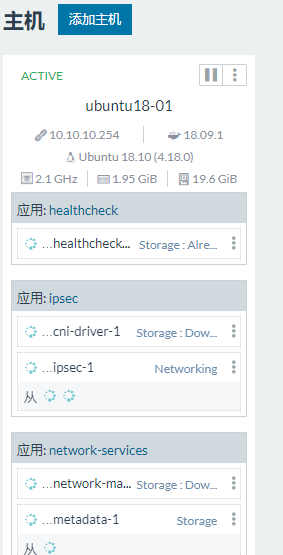

`系统笔记

# 一、安装docker

参考：`https://yq.aliyun.com/articles/625340`。

```shell
#安装curl
$ sudo apt-get update
$ sudo apt-get install curl

#安装软件包以允许apt通过HTTPS使用存储库
$ sudo apt-get install apt-transport-https ca-certificates curl software-properties-common

#添加Docker的官方GPG密钥
$ curl -fsSL https://download.docker.com/linux/ubuntu/gpg | sudo apt-key add -
#备注：可使用以下命令进行验证秘钥指纹 9DC8 5822 9FC7 DD38 854A E2D8 8D81 803C 0EBF CD88
$ sudo apt-key fingerprint 0EBFCD88

#可选设定稳定存储库，可不设置，则自动使用（deb [arch=amd64] https://download.docker.com/linux/ubuntu xenial stable）
$ sudo add-apt-repository "deb [arch=amd64] https://download.docker.com/linux/ubuntu  xenial  stable"

#更新apt资源包，并进行安装docker ce
$ sudo apt-get update
$ sudo apt-get -y install docker-ce

#基础安装完成，可以先进行测试一下是否可用
$ sudo docker version

#如果执行时不想使用sudo命令，可以进行设置用户组，并将当前用户增加到该组中
$ sudo groupadd docker
$ sudo usermod -aG docker $USER

#注销一下，再执行以下命令
$ docker run hello-world

```


# 二、mysql镜像安装

这里使用官方镜像，相关安装内容参考：`https://hub.docker.com/_/mysql`。

```shell
$ docker pull mysql
```


```shell
docker run -di --name=tensquare_mysql -p 13306:3306 -e MYSQL_ROOT_PASSWORD=walp1314 mysql
```


然后使用工具连接上即可。然后将“建表语句”目录下的所有`sql`刷到数据库中。后面可以使用命令

```she
docker start tensquare_mysql
```

来启动已经存在的容器。


# 三、安装redis

参考：`https://hub.docker.com/_/redis`

```shell
docker run -di --name=tensquare_redis -p 16379:6379 redis:latest
```


# 四、安装mongoDB

参考：`https://hub.docker.com/_/mongo`

```shell
docker run -di --name=tensquare_mongo -p 27017:27017 mongo:latest
```

连接（当然需要有`mongo`的客户端`studio 3T`）

```shell
mongo 10.10.10.254:27017
```


# 五、安装Elasticsearch

参考：`https://hub.docker.com/_/elasticsearch`

```shell
docker run -di --name=tensquare_es -e "discovery.type=single-node" -p 9300:9300 -p 9200:9200 elasticsearch:6.5.4
```

注意：`9300`端口是使用`tcp`客户端连接使用的端口。`9200`端口是通过`http`协议连接`es`使用的端口。我们在使用`java`访问的时候使用的是`9300`。同时`discovery.type=single-node`如果不加则启动容器后会自动退出且无法访问。

创建好容器之后使用命令

```shell
docker exec -it tensquare_es /bin/bash
```

进入到容器中的目录`config`中修改配置文件`elasticsearch.yml`

```yaml
cluster.name: "docker-cluster"
network.host: 0.0.0.0

# minimum_master_nodes need to be explicitly set when bound on a public IP
# set to 1 to allow single node clusters
# Details: https://github.com/elastic/elasticsearch/pull/17288
discovery.zen.minimum_master_nodes: 1

```

版本不同，会有差异，后面我们在`search`模块中配置的时候不仅要配置`ip`、端口，而且还要配置`cluster.name`。


***自定义词库***

- 进入`elasticsearch/plugins/ik/config`目录
- 新建一个`my.dic`文件，编辑内容：

```tex
传智播客
```

- 修改`IKAnalyzer.cfg.xml`（在`ik/config`目录下）

    ```xml
    <properties>
    	<comment>IK Analyzer 扩展配置</comment>
    	<!‐‐用户可以在这里配置自己的扩展字典 ‐‐>
    	<entry key="ext_dict">my.dic</entry>
    	<!‐‐用户可以在这里配置自己的扩展停止词字典‐‐>
    	<entry key="ext_stopwords"></entry>
    </properties>
    ```

然后进行验证


***IK分词器安装***

下载和`ES`对应版本的`IK`分词器，然后解压拷贝到`ES`容器的`plugin`目录

```shell
docker copy ik tensquare_es:/usr/share/elasticsearch/plugins
```

然后重启让分词器生效，这里我们使用的是`6.5.4`版本，使用自带的例子进行验证

```shell
#1.create a index
curl -XPUT http://localhost:9200/index

#2.create a mapping
curl -XPOST http://localhost:9200/index/fulltext/_mapping -H 'Content-Type:application/json' -d'
{
        "properties": {
            "content": {
                "type": "text",
                "analyzer": "ik_max_word",
                "search_analyzer": "ik_max_word"
            }
        }

}'

#3.index some docs
curl -XPOST http://localhost:9200/index/fulltext/1 -H 'Content-Type:application/json' -d'
{"content":"美国留给伊拉克的是个烂摊子吗"}
'
curl -XPOST http://localhost:9200/index/fulltext/2 -H 'Content-Type:application/json' -d'
{"content":"公安部：各地校车将享最高路权"}
'
curl -XPOST http://localhost:9200/index/fulltext/3 -H 'Content-Type:application/json' -d'
{"content":"中韩渔警冲突调查：韩警平均每天扣1艘中国渔船"}
'
curl -XPOST http://localhost:9200/index/fulltext/4 -H 'Content-Type:application/json' -d'
{"content":"中国驻洛杉矶领事馆遭亚裔男子枪击 嫌犯已自首"}
'

#4.query with highlighting
curl -XPOST http://localhost:9200/index/fulltext/_search  -H 'Content-Type:application/json' -d'
{
    "query" : { "match" : { "content" : "中国" }},
    "highlight" : {
        "pre_tags" : ["<tag1>", "<tag2>"],
        "post_tags" : ["</tag1>", "</tag2>"],
        "fields" : {
            "content" : {}
        }
    }
}
'
#Result
{
    "took": 14,
    "timed_out": false,
    "_shards": {
        "total": 5,
        "successful": 5,
        "failed": 0
    },
    "hits": {
        "total": 2,
        "max_score": 2,
        "hits": [
            {
                "_index": "index",
                "_type": "fulltext",
                "_id": "4",
                "_score": 2,
                "_source": {
                    "content": "中国驻洛杉矶领事馆遭亚裔男子枪击 嫌犯已自首"
                },
                "highlight": {
                    "content": [
                        "<tag1>中国</tag1>驻洛杉矶领事馆遭亚裔男子枪击 嫌犯已自首 "
                    ]
                }
            },
            {
                "_index": "index",
                "_type": "fulltext",
                "_id": "3",
                "_score": 2,
                "_source": {
                    "content": "中韩渔警冲突调查：韩警平均每天扣1艘中国渔船"
                },
                "highlight": {
                    "content": [
                        "均每天扣1艘<tag1>中国</tag1>渔船 "
                    ]
                }
            }
        ]
    }
}
```


***Logstash安装及使用***

 `MySQL`数据导入`Elasticsearch`

* （1）在`logstash-5.6.8`安装目录下创建文件夹`mysqletc `（名称随意）
* （2）文件夹下创建`mysql.conf` （名称随意） ，内容直接查看`mysqletc/mysql.conf`。
* （3）将`mysql`驱动包`mysqletc/mysql-connector-java-5.1.46.jar`拷贝至`D:/logstash5.6.8/mysqletc/`		下 。`D:/logstash-5.6.8`是你的安装目录
* （4）命令行下执行
    `logstash ‐f ../mysqletc/mysql.conf`
    观察控制台输出，每间隔`1`分钟就执行一次`sql`查询。再次刷新`elasticsearch-head`的数据显示，看是否也更新了数据。


***kibana安装***

待续


***系统调优***
修改`/etc/security/limits.conf `，追加内容

```shell
* soft nofile 65536
* hard nofile 65536
```

这里，`nofile`是单个进程允许打开的最大文件个数，`soft nofile `是软限制 `hard nofile`是硬限制

修改`/etc/sysctl.conf`，追加内容

vm.max_map_count=655360

限制一个进程可以拥有的VMA(虚拟内存区域)的数量

执行下面命令 修改内核参数马上生效

sysctl ‐p


# 六、安装RabbitMQ

参考：`https://hub.docker.com/_/rabbitmq`

```shell
docker run -di --name=tensquare_rabbitmq -p 5671:5617 -p 5672:5672 -p 4369:4369 -p 15671:15671 -p 15672:15672 -p 25672:25672 rabbitmq:management
```

注意：这里拉取的镜像是`rabbitmq:management`，这是带管理界面的，方便管理。然后使用地址`http://10.10.10.254:15672/#/`访问。用户名和密码都是`guest`。

端口说明：

* `15672` (if management plugin is enabled)
* `15671` management监听端口
* `5672, 5671` (AMQP 0-9-1 without and with TLS)
* `4369` (epmd) epmd 代表 Erlang 端口映射守护进程
* `25672` (Erlang distribution)


创建一个队列


这里我们创建了一个名为`itcast`的队列。下面先进行一下直接模式的测试（直接模式就相当于不经过交换器直接将消息发给队列存储）


创建一个`rabbitmq`的`Demo`模块进行测试，开始的时候是这样的


现在跑一下`sendTest`测试方法后


然后写一个消费者类`Customer1`，写好之后直接启动应用，就会在控制台打印存入的消息


而在管理界面中消息变为`0`。

下面进行分列模式的测试（这种模式就好比有几个不同类型的队列，分别有不同的作用，但是现在一个消息同时想使用这三个队列，如果使用直接模式，那么就得发三次，所以这里使用交换器）

首先再创建两个队列（`itcast1、itcast2`），同时创建一个交换器


然后将该交换器和三个队列绑定（点击交换器进入绑定界面）


然后再创建两个消费者类（`Customer1、Customer2`）然后直接启动应用，然后再跑测试方法`send1Test`。


下面对主题模式进行测试，相比分列模式，其实就是多了一个绑定的规则


绑定规则就是


其他两个的匹配规则分别是`#.log、good.log`，一般使用#通配符，比如

* `good.#`能匹配`good.abc、good.adc.def`
* `#.log`能匹配`abc.log、abc.def.log`
* `good.log`只能匹配`good.log`
* `good.*`能匹配`good.abc`，不能匹配`good.abc.def`
* `*.log`能匹配abc.log，不能匹配`abc.def.log`

此时可以启动应用后跑一下测试方法`send2Test`即可。


# 七、微服务容器部署与持续集成

## 7.1 Dockerfile相关命令

| 命令                                 | 作用                                                         |
| ------------------------------------ | ------------------------------------------------------------ |
| `FROM image_name:tag`                | 定义了使用哪个基础镜像启动构建流程                           |
| `MAINTAINER user_name`               | 声明镜像的创建者                                             |
| `ENV key value`                      | 设置环境变量 (可以写多条)                                    |
| `RUN command`                        | 是`Dockerfile`的核心部分(可以写多条)                         |
| `ADD source_dir/file dest_dir/file`  | 将宿主机的文件复制到容器内，如果是一个压缩文件，
将会在复制后自动解压 |
| `COPY source_dir/file dest_dir/file` | 和`ADD`相似，但是如果有压缩文件并不能解压                    |
| `WORKDIR path_dir`                   | 设置工作目录                                                 |
| `EXPOSE port1 prot2`                 | 用来指定端口，使容器内的应用可以通过端口和外界交互           |
| `CMD argument`                       | 在构建容器时使用，会被`docker run` 后的`argument`覆盖        |
| `ENTRYPOINT argument`                | 和`CMD`相似，但是并不会被`docker run`指定的参数覆盖          |
| `VOLUME`                             | 将本地文件夹或者其他容器的文件挂载到容器中                   |


## 7.2 使用脚本创建镜像

创建一个目录，这里是`/usr/yj/jdk8Image`，然后将`jdk`包`jdk-8u151-linux-x64.tar.gz`复制到此目录，然后创建一个`Dockerfile`文件

```dockerfile
#依赖镜像名称和ID
FROM ubuntu:18.10
#指定镜像创建者信息
MAINTAINER YJ
#切换工作目录
WORKDIR /usr
RUN mkdir /usr/local/java
#ADD 是相对路径jar,把java添加到容器中
ADD jdk-8u151-linux-x64.tar.gz /usr/local/java
#配置java环境变量
ENV JAVA_HOME /usr/local/java/jdk1.8.0_151
ENV JRE_HOME $JAVA_HOME/jre
ENV CLASSPATH $JAVA_HOME/lib/dt.jar:$JAVA_HOME/lib/tools.jar:$JRE_HOME/lib:$CLASSPATH
ENV PATH $JAVA_HOME/bin:$PATH
```

在此目录中使用命令`docker build -t='jdk8u151' .`创建一个`jdk`镜像。最后创建了一个`jdk8u151:latest`的镜像。


创建好之后可以使用命令`docker run -id --name=tensquare_jdk8 jdk8u151`创建一个容器，看能否创建成功。


## 7.3 Docker私有仓库

### 7.3.1 私有仓库的搭建与配置

```shell
docker pull registry
docker run -id --name=regitry -p 5000:5000 registry
```

然后可以使用地址`http://10.10.10.254:5000/v2/_catalog`访问仓库，返回`{"repositories": []}`表示成功。然后我们要将刚才创建好的镜像上传到此仓库中，修改`sudo vim /etc/default/docker`文件

```shell
DOCKER_OPTS="--registry-mirror=https://registry.docker-cn.com --insecure-registry=10.10.10.254:5000"
```

修改`/lib/systemd/system/docker.service`

```shell
EnvironmentFile=-/etc/default/docker
ExecStart=/usr/bin/dockerd -H fd:// $DOCKER_OPTS
```

然后重新加载、重启上传镜像

```shell
sudo systemctl daemon-reload
sudo systemctl restart docker
docker tag jdk8u151 10.10.10.254:5000/jdk8u151
docker push 10.10.10.254:5000/jdk8u151
```

使用`curl localhost:5000/v2/_catalog`返回`{"repositories":["jdk8u151"]}`表示成功


## 7.4 Docker Maven插件

微服务部署有两种方式：

* （1）手动部署：首先基于源码打包生成`jar`包（或`war`包）,将`jar`包（或`war`包）上传至虚拟机并拷贝至`JDK`容器。
* （2）通过`Maven`插件自动部署。
    对于数量众多的微服务，手动部署无疑是非常麻烦的做法，并且容易出错。所以我们这里学习如何自动部署，这也是企业实际开发中经常使用的方法。


`Maven`插件自动部署步骤：
（1）修改宿主机的`docker`配置，让其可以远程访问

```shell
sudo vim /lib/systemd/system/docker.service
```

其中`ExecStart=`后添加配置 `‐H tcp://0.0.0.0:2375 ‐H unix:///var/run/docker.sock`。这里`0.0.0.0:2375`表示任意`IP`都可以访问`2375`端口。


（2）刷新配置，重启服务

```shell
sudo systemctl daemon-reload
sudo systemctl restart docker
docker start registry
```


（3）在`Config`模块中配置

```xml
<build>
	<finalName>app</finalName>
	<plugins>
		<!--<plugin>-->
			<!--<groupId>org.springframework.boot</groupId>-->
			<!--<artifactId>spring‐boot‐maven‐plugin</artifactId>-->
		<!--</plugin>-->
		<!--docker的maven插件，官网： https://github.com/spotify/docker-maven-plugin -->
		<plugin>
			<groupId>com.spotify</groupId>
			<artifactId>docker-maven-plugin</artifactId>
			<version>0.4.13</version>
			<configuration>
				<imageName>10.10.10.254:5000/${project.artifactId}:${project.version}</imageName>
				<baseImage>jdk8u151</baseImage>
				<entryPoint>["java", "-jar", "/${project.build.finalName}.jar"]</entryPoint>
				<resources>
					<resource>
						<targetPath>/</targetPath>
						<directory>${project.build.directory}</directory>
						<include>${project.build.finalName}.jar</include>
					</resource>
				</resources>
				<dockerHost>http://10.10.10.254:2375</dockerHost>
			</configuration>
			<dependencies>
				<dependency>
					<groupId>javax.activation</groupId>
					<artifactId>activation</artifactId>
					<version>1.1.1</version>
				</dependency>
			</dependencies>
		</plugin>
	</plugins>
</build>
```

这里`spring‐boot‐maven‐plugin`如果在父工程中已经添加，此处无需再次添加。同时如果不添加依赖`activation`则在编译的时候会报

`Caused by: java.lang.ClassNotFoundException: javax.activation.DataSource`

最后就是检查相关配置信息，如基础镜像名不要写错。然后使用命令

`mvn clean package docker:build -DpushImage`

将`Config`模块编译打包并上传到私有仓库中。完了之后检查仓库是否存在此镜像

`{"repositories":["jdk8u151","tensquare_config"]}`

使用命令`docker run -di --name=tensquare_config -p 12000:12000 10.10.10.254:5000/tensquare_config:1.0-SNAPSHOT`创建容器。使用地址

`http://10.10.10.254:12000/base-dev.yml`访问，如果能访问到配置文件则表示成功。有时候会比较慢。


# 八、持续集成

## 8.1 安装gogs

```shell
#这里-v表示将gogs的/data挂在到本地的/var/gogsdata目录中
docker run -di --name=gogs -p 10022:22 -p 3000:3000 -v /var/gogsdata:/data gogs/gogs
```

使用地址`http://10.10.10.254:3000`访问


点击立即安装，然后选择马上注册


然后点击创建账户，登陆


然后创建一个仓库


然后我们要将代码上传到本地仓库中，这主要是为了持续集成不受网络影响，但是之前我们以前将代码提交到了`github`上，此时我们可以在`IDEA`中添加多个远程仓库。修改工程中文件`.git/config`

```
[remote "origin"]
	url = https://github.com/yjaal/tensquare.git
	fetch = +refs/heads/*:refs/remotes/origin/*
	url = http://10.10.10.254:3000/yjaal/tensquare.git
```

这里我们将本地仓库地址添加在这里，然后就可以同时提交到两个远程仓库。


## 8.12安装jenkins

```shell
wget -q -O - https://pkg.jenkins.io/debian/jenkins-ci.org.key | sudo apt-key add - 
sudo sh -c 'echo deb http://pkg.jenkins.io/debian-stable binary/ > /etc/apt/sources.list.d/jenkins.list' 
sudo apt-get update 
sudo apt-get install jenkins 
```

在安装后会自动启动，但是可能会出现招不到jdk的情况或其他问题，对于jdk的问题我们可以在配置文件

```shell
sudo vim /etc/init.d/jenkins
#添加jdk路径
PATH=/bin:/usr/bin:/sbin:/usr/sbin:/usr/local/install/jdk8/bin
#修改do_start()方法中check_tcp_port "http" "$HTTP_PORT" "1888"
#这里1888是自定义端口
sudo vim /etc/default/jenkins
#修改
NAME=root
HTTP_PORT=1888
```

这里相关详细内容参考`https://www.howtoing.com/how-to-install-jenkins-on-ubuntu-18-04`

我在安装好之后发现能成功启动，但是在浏览器访问时拒绝访问，未解决。


后面我们直接下载`jenkins.war`包（包中自带`jetty`服务器），然后使用命令`java -jar jenkins.war --httpPort=8888`启动。使用地址`http://10.10.10.254:8888`访问。


后面要选择安装插件，我们选择默认安装。由于网络原因可能有些插件安装失败，这个可以先跳过。


**安装插件**

上面如果`git`插件安装失败，这里我们需要再次手动安装。然后再安装`maven`插件

系统管理 --> 插件管理 --> 可选插件(`Available`)，搜索`maven`插件`[Maven Integration]`


**服务器安装maven**

```shell
tar xvzf apache-maven-3.6.0-bin.tar.gz
mv apache-maven-3.6.0 /usr/local/install/
mv apache-maven-3.6.0/ maven3.6
mkdir repository
```

修改`maven`配置文件`/usr/local/install/maven3.6/conf/settings.xml`

```xml
<localRepository>/usr/local/install/repository</localRepository>
<profiles>
	<profile>
		<id>repository-profile</id>
		<repositories>
			<repository>
				<id>central</id>
				<name>Central Repository</name>
				<layout>default</layout>
				<url>http://maven.aliyun.com/nexus/content/groups/public</url>
				<snapshots>
					<enabled>true</enabled>
				</snapshots>
				<releases>
					<enabled>true</enabled>
				</releases>
			</repository>
		</repositories>
	</profile>
</profiles>
<activeProfiles>
	<activeProfile>repository-profile</activeProfile>
</activeProfiles>
```

最好将相关的包拷贝到服务器仓库中，那样就不用再次下载了。但是这里对于`common`模块我们首先得将其打包`mvn clean install`。然后将仓库拷贝到服务器上。


注意：在`IDEA`中使用`maven`命令时一定要配置`maven home`目录，同时对于`tensquare_rabbitmqDemo`模块来说，编译的时候需要在父工程的`pom`文件中将其注释掉。


**全局配置**

系统管理 --> 全局工具配置


然后点击`save`。


## 8.13 创建一个工程


点击保存


这样就可以构建，同时上传到`docker`仓库中。不过要注意：之前我们在`config`模块中为了打镜像所作的一些配置，这里也要添加到`Eureka`模块中来，同时相关配置文件需要检查`ip(10.10.10.254)`。在打包成镜像的过程中一定要事先将`docker`镜像仓库启动。闯将成功后可以看到相关`Eureka`模块的镜像。然后使用命令启动此镜像

`docker run -di --name=tensquare_eureka -p 6868:6868 10.10.10.254:5000/tensquare_eureka:1.0-SNAPSHOT `，然后使用地址`http://10.10.10.254:6868`访问。使用命令`docker logs -f -t --tail 100 tensquare_eureka`查看容器`tensquare_eureka`最后100行启动日志。如果启动失败，最大可能是因为`Eureka`启动无法通过`config`模块获取到配置文件。此时要检查`eureka`是否添加了相关`config`依赖和其配置文件是否正确。创建成功后也要等待很长时间才能访问。


# 九、容器管理与容器监控

## 9.1 容器管理工具Rancher

`Rancher`是一个开源的企业级全栈化容器部署及管理平台。`Rancher`为容器提供一揽子基础架构服务：`CNI`兼容的网络服务、存储服务、主机管理、负载均衡、防护墙……。`Rancher`让上述服务跨越公有云、私有云、虚拟机、物理机环境运行，真正实现一键式应用部署和管理。


```shell
docker pull rancher/server
docker run -di --name=rancher --restart=always -p 9090:8080 rancher/server
```

`restart`为重启策略

* `no`，默认策略，在容器退出时不重启容器

* `on-failure`，在容器非正常退出时（退出状态非0），才会重启容器

    * `on-failure:3`，在容器非正常退出时重启容器，最多重启3次

* `always`，在容器退出时总是重启容器
* `unless-stopped`，在容器退出时总是重启容器，但是不考虑在`Docker`守护进程启动时就已经停止了的容器


然后使用地址`http://10.10.10.254:9090`访问，一开始启动会很慢，多刷新几次。进入之后在页面最下方切换语言。这样会有一个默认的环境，这里的环境就是一个服务器，一个`rancher`可以连接多个服务器。点击`Defualt --> 环境管理 --> 添加环境`，这里是为本服务器添加环境。


然后点击`Default --> tensquare_dev`切换到刚才创建的环境。


**添加镜像库**

点击`基础架构 --> 镜像库`进行镜像库的添加


这里没有用户名和密码。这里相当于配置了一个镜像提供的地址。


**添加主机**

上面添加了镜像库，那我们从这个镜像库拿到镜像后创建的容器应该放在哪台主机上，这需要我们配置。点击`基础架构 --> 主机`。


这里由于只有一台机器，所以地址就不变，如果是其他机器，则需要选择“其他地址”，直接点击“保存”。


这里填上地址，这个地址是给下面步骤用的，先不要点击关闭，先点击第五步的复制，将其中的命令复制出来到主机上去执行。因为此工具要去连接主机，需要借助一个媒介工具，此处需要联网。

```shell
sudo docker run -e CATTLE_AGENT_IP="10.10.10.254"  --rm --privileged -v /var/run/docker.sock:/var/run/docker.sock -v /var/lib/rancher:/var/lib/rancher rancher/agent:v1.2.11 http://10.10.10.254:9090/v1/scripts/04E3B1627F7D9F7B3750:1546214400000:nQWd2dYWpJIsqIs197haChA9s
```

执行时如果报错

```
INFO: Running Agent Registration Process, CATTLE_URL=http://10.10.10.254:9090/v1
INFO: Attempting to connect to: http://10.10.10.254:9090/v1
ERROR: http://10.10.10.254:9090/v1 is not accessible (Connection timed out after 15001 milliseconds)
```

此时可以使用下面的命令将`9090`端口设置为可访问

```shell
sudo ufw allow 9090
sudo ufw allow 4500
sudo ufw allow 500
```

然后再执行命令

```shell
yjaal@ubuntu18-01:~$ sudo docker run -e CATTLE_AGENT_IP="10.10.10.254"  --rm --privileged -v /var/run/docker.sock:/var/run/docker.sock -v /var/lib/rancher:/var/lib/rancher rancher/agent:v1.2.11 http://10.10.10.254:9090/v1/scripts/04E3B1627F7D9F7B3750:1546214400000:nQWd2dYWpJIsqIs197haChA9s

INFO: Running Agent Registration Process, CATTLE_URL=http://10.10.10.254:9090/v1
INFO: Attempting to connect to: http://10.10.10.254:9090/v1
INFO: http://10.10.10.254:9090/v1 is accessible
INFO: Configured Host Registration URL info: CATTLE_URL=http://10.10.10.254:9090/v1 ENV_URL=http://10.10.10.254:9090/v1
INFO: Inspecting host capabilities
INFO: Boot2Docker: false
INFO: Host writable: true
INFO: Token: xxxxxxxx
INFO: Running registration
INFO: Printing Environment
INFO: ENV: CATTLE_ACCESS_KEY=0E3BA82D7E939DB80967
INFO: ENV: CATTLE_AGENT_IP=10.10.10.254
INFO: ENV: CATTLE_HOME=/var/lib/cattle
INFO: ENV: CATTLE_REGISTRATION_ACCESS_KEY=registrationToken
INFO: ENV: CATTLE_REGISTRATION_SECRET_KEY=xxxxxxx
INFO: ENV: CATTLE_SECRET_KEY=xxxxxxx
INFO: ENV: CATTLE_URL=http://10.10.10.254:9090/v1
INFO: ENV: DETECTED_CATTLE_AGENT_IP=172.17.0.1
INFO: ENV: RANCHER_AGENT_IMAGE=rancher/agent:v1.2.11
INFO: Launched Rancher Agent: 9c3cf57119dcbcad4f976288346818f041d5219f8f8d482f0ae5f5026e95075f
```

此时表明成功，然后点击页面的“关闭”按钮。但是发现页面跳转后并没有显示相关内容，主机未添加成功，使用命令`docker logs [rancher-agent ID]`查看相关日志。


首先，需要删除`/var/lib/rancher/state`下的文件，该文件用于标记该主机的唯一性，然后删除`agent`容器


接下来，需要在`/etc/docker/daemon.json`中添加`dns`没有此文件就创建一个

```json
{
"dns": ["8.8.8.8","8.8.4.4"]
}

```

然后重启`docker`

```shell
systemctl daemon-reload
systemctl restart docker.service
service docker restart 
```

然后重新执行命令，之后点击关闭，多刷新几次。



**添加应用**

点击`应用 --> 全部 --> 添加应用`。


**添加服务**

这里所谓的服务其实就是容器，我们之前你创建容器时通过命令，这里可以通过添加服务的方式进行容器创建。比如我们之前创建的`mysql`数据库容器，这里可以通过下面的方式进行创建。（名字不能有下划线）


环境变量有就添加，没有就不添加。此容器之前已经有了，这里就不再实际创建了。这里我们重新添加`config`模块微服务容器。


创建成功后


在这里删除容器的时候先关闭再删除，不要直接删除，那样会等待很久。应用可能会因为读取配置文件耗时过长，则会自动重启，可以在`rancher`中查看服务日志。


